<div align="center">
  <a href="https://crosscast.art">
    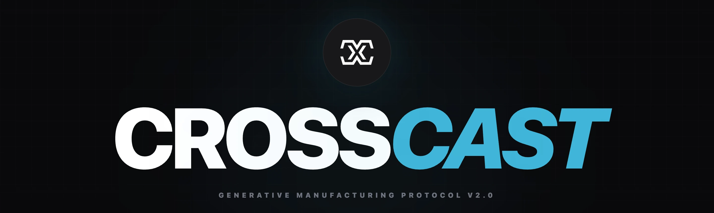
  </a>

  <br />
  <br />

  <h1 align="center">CrossCast | Generative Design Suite</h1>

  <p align="center">
    <b>Stop printing trinkets. Start manufacturing meaning.</b>
    <br />
    <br />
    <a href="https://crosscast.art"><strong>Explore the Live Demo »</strong></a>
    <br />
    <br />
    <a href="https://crosscast.art">View Demo</a>
    ·
    <a href="https://github.com/tarikpinarli/crosscast/issues">Report Bug</a>
    ·
    <a href="https://github.com/tarikpinarli/crosscast/issues">Request Feature</a>
  </p>
</div>

## Description

**CrossCast** is a commercial generative design suite that empowers users to manufacture meaning, not just trinkets. It transforms abstract input data—such as geographic coordinates, audio waveforms, and typography—into manufacturing-ready 3D models.

**Target Audience:** The platform is specifically designed for **3D printing enthusiasts** who want to create complex, personalized objects but lack experience with traditional 3D modeling software (CAD).

The project bridges the gap between digital creativity and physical manufacturing by offering a "Cyber/Industrial" user interface for real-time manipulation of complex 3D geometry. Built as a sustainable commercial ecosystem, CrossCast operates on a **freemium model**: users can freely utilize the sophisticated design engines to visualize concepts, while the export of high-fidelity, manufacturing-ready files is secured behind an integrated payment gateway.

---

## 📸 Interface Showcase

### 1. Shadow Caster (Intersection Engine)
> *Bespoke CSG intersection logic. Calculates the volumetric overlap of dual silhouettes to create complex geometry from simple 2D inputs.*

| **Profile View** | **Front View** | **Resulting Mesh** |
| :---: | :---: | :---: |
| 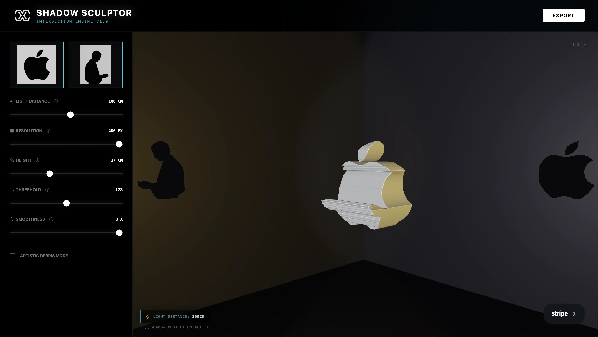 | 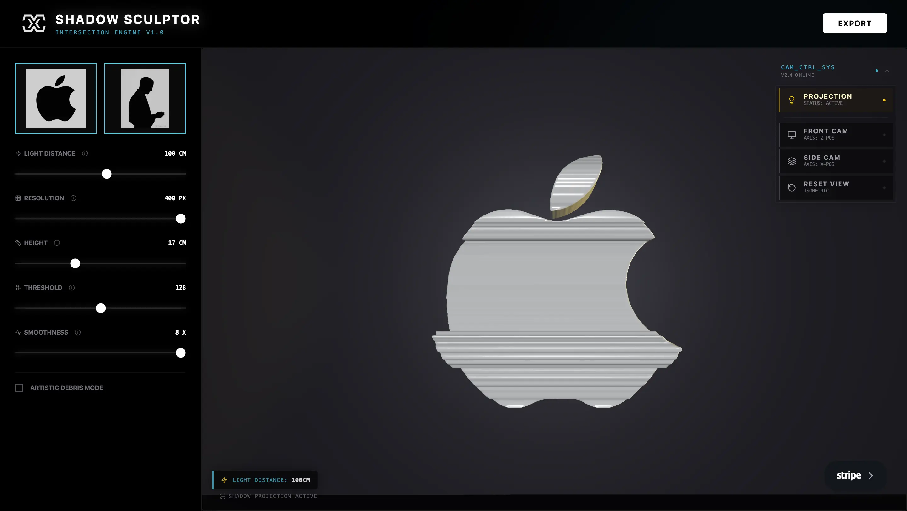 | 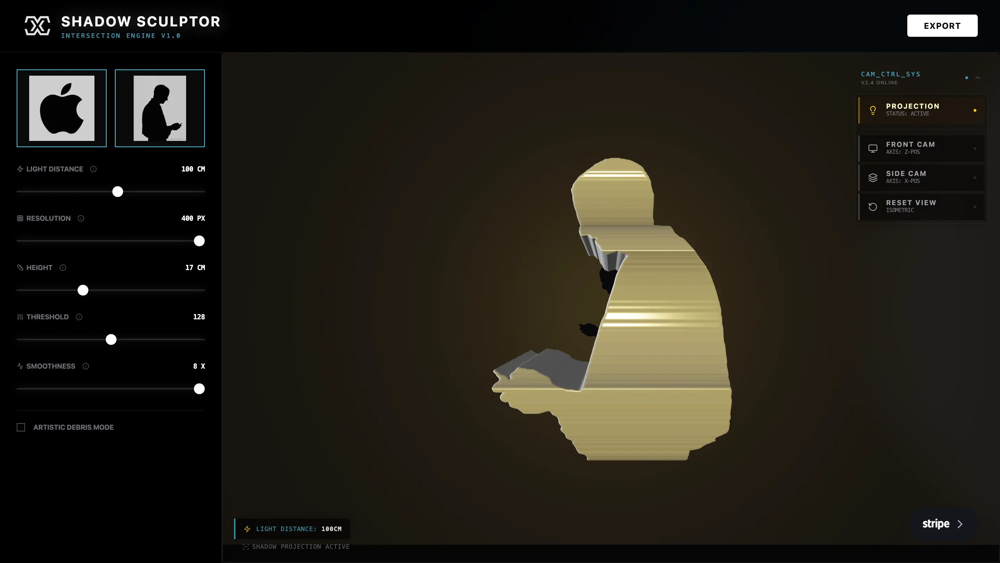 |

### 2. Terra-Former (GeoSculptor)
> *Streaming GIS telemetry reconstruction. Converts raw satellite elevation data into high-fidelity topographic models ready for printing.*

| **Map Selection** | **Terrain Analysis** | **3D Generation** |
| :---: | :---: | :---: |
| 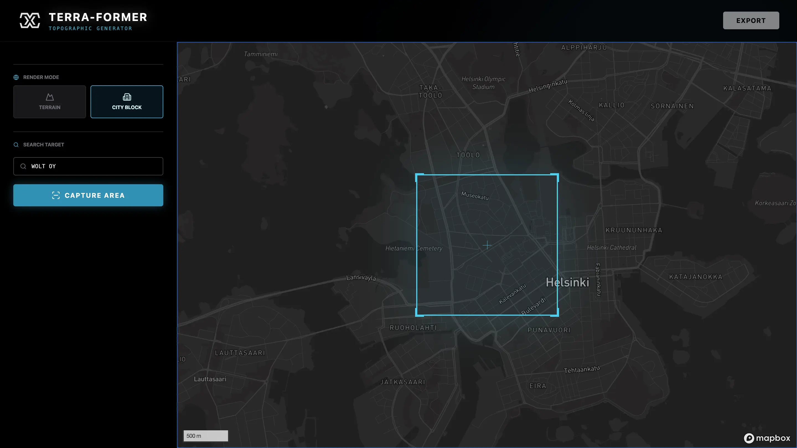 | 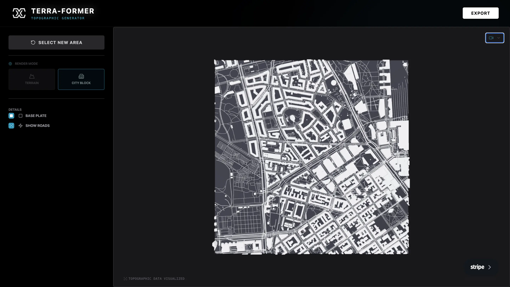 | 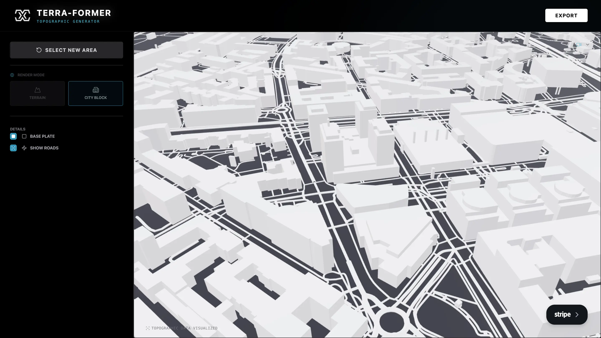 |

### 3. Resonance (Voice to 3D)
> *Spectral audio analysis. Materializes voice recordings and sound waves into solid 3D frequency landscapes.*

| **Audio Input** | **Frequency Shaping** | **Radial Sculpture** |
| :---: | :---: | :---: |
| 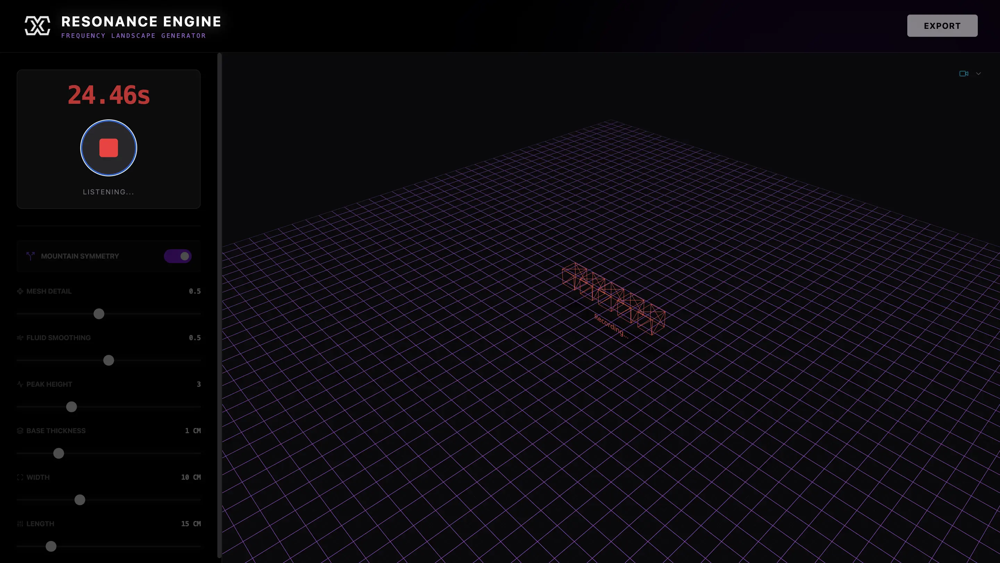 | 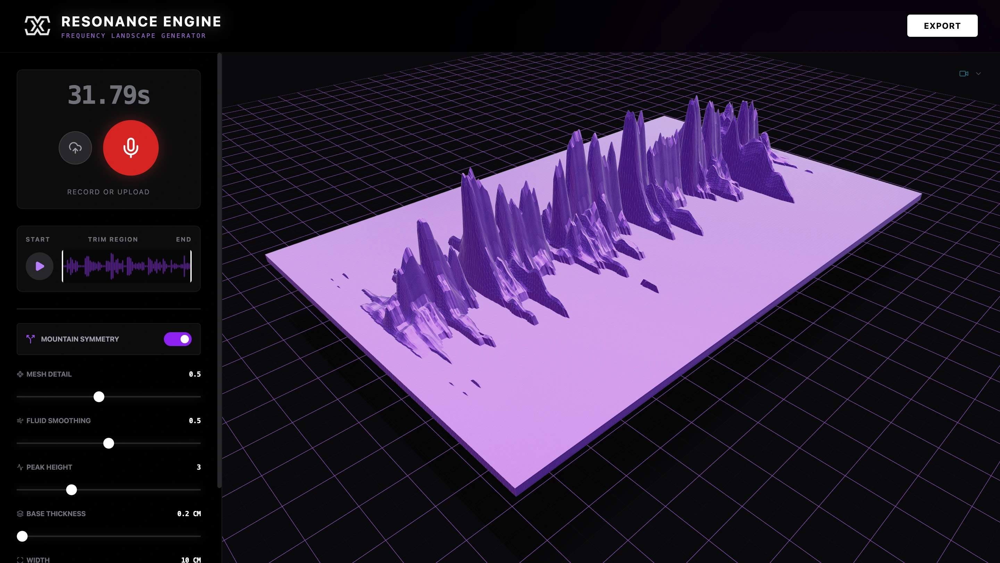 | 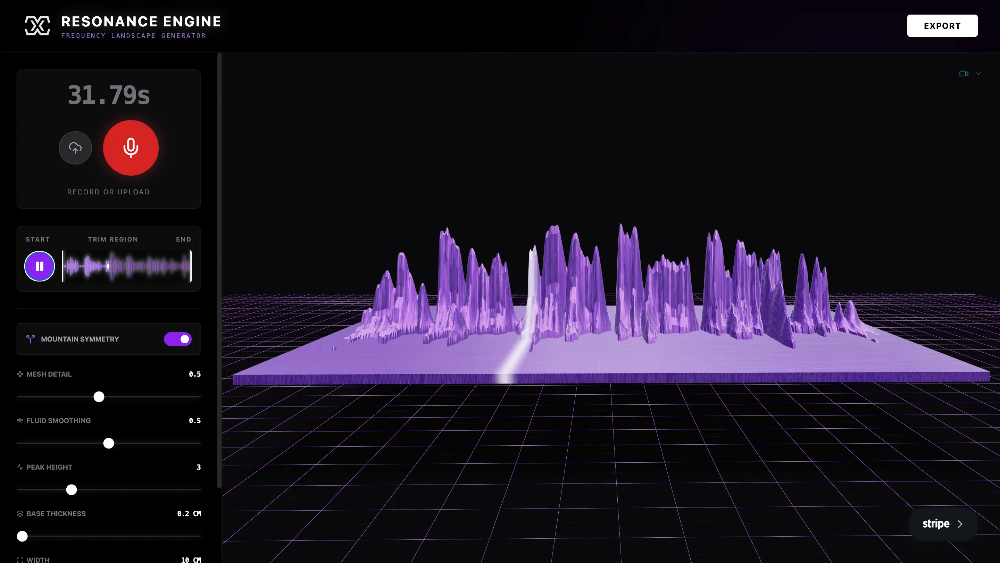 |

### 4. Commerce Integration
> *Secure, integrated payment gateway. Seamlessly handles session tokens and manufacturing licenses via Stripe. Note: A secure payment is required to unlock and download the final manufacturing-ready 3D model files.*

| **Secure Checkout** |
| :---: |
| 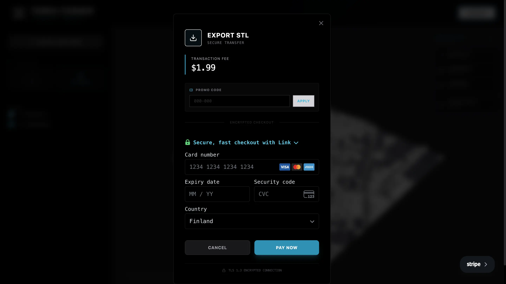 |

---

## Project Description & Design Choices

This project operates as a full-stack application split into two distinct services: a React frontend and a Go (Golang) backend.

### Main Design Choices
1.  **Backend Migration to Go:** The backend was explicitly converted to **Go (Golang)** to satisfy the requirements for the **Wolt Internship** application. This choice leverages Go's concurrency model and performance, which is ideal for handling the real-time socket connections used in the application.
2.  **Client-Side Generation:** Heavy geometry processing (Three.js/React Three Fiber) is offloaded to the client to reduce server costs and provide instant visual feedback to the user.
3.  **Dockerization:** Docker is used to containerize the Go backend. This ensures that the application runs identically on the developer's local machine and the production server (Render), eliminating "it works on my machine" issues.
4.  **Deployment Strategy:**
    * **Frontend:** Deployed on **Vercel** for its seamless React integration.
    * **Backend:** Deployed on **Render**. Since the free tier is used, the server spins down after inactivity. A **cronjob** has been implemented to ping the backend every 5 minutes, ensuring high availability.

### Comparison: Secrets vs. Environment Variables
In the development of this project, distinct approaches were used to handle configuration data:

* **Environment Variables:** These are key-value pairs used to configure the application's behavior based on where it is running (e.g., `PORT=5005` or `BACKEND_URL`). In this project, `config.ts` uses environment variables to automatically switch between `localhost` (DEV) and the Render URL (PROD). These are generally visible in the deployment configuration but should not contain sensitive data in plain text if the repo is public.
* **Secrets:** These are strictly confidential pieces of information, such as the **Stripe Secret Key** or **Mapbox Access Token**. Unlike standard environment variables which might be checked into non-public files or logs, secrets must never be committed to version control (`git`). In this project, secrets are injected directly into the Vercel and Render dashboards at runtime and accessed via `process.env` or `os.Getenv`, ensuring they remain secure.

### Included Sources
The repository contains:
* `src/`: The complete TypeScript frontend source code (React, Three.js components, generative algorithms).
* `backend/`: The Go API source code, including handlers for Stripe payments and Socket.io connections.
* `Dockerfile`: The blueprint for building the backend container image.

---

## Instructions

### Prerequisites
* Node.js (v18+)
* Go (v1.24+)
* Docker (Optional, for containerized running)

### 1. Installation
Clone the repository:
```bash
git clone [https://github.com/tarikpinarli/crosscast.art.git](https://github.com/tarikpinarli/crosscast.art.git)
cd crosscast